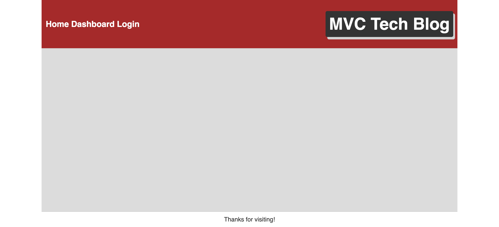

# 14-Model-View-Controller-Tech-Blog

## Project Description

This project uses the Model-View-Controller (MVC) paradigm to create a blog-style website where developers can create an account, edit their information, make posts, edit posts, and comment on other user's posts.

## Tools Used to Create This Project

- JavaScript ES6
- Node.js
- Express.js
- dotenv (npm package used to store environmental variables used in a project locally so sensitive data like root passwords are not exposed on GitHub)
- MySQL
- Sequelize (npm package for integrating MySQL and Node.js)
- bcrypt (npm package for password hashing)
- handlebars (npm package for a template engine used for html and javascript integration on the front-end)
- Heroku (hosting platform)

## Usage

The application is deployed on Heroku at https://secret-chamber-33052.herokuapp.com/

screenshot of the Application:

Visit the website on Heroku. You can view posts and visit links as a visitor, create your own account, and as an authenticated user you can add your own posts and comment on other posts as well. You can edit titles and content or delete your own posts as well. You can also update your username, email, and password.
